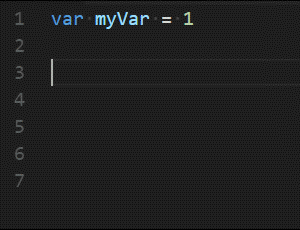

# **Colonize**

## Features

- Adds two shotcuts to insert semicolons with ease;

  - <kbd>shift</kbd> + <kbd>enter</kbd> Insert semicolon at the end of line and continue on the same line
  - <kbd>alt</kbd> + <kbd>enter</kbd> Insert semicolon at the end of line and continue on the new line

- First accepts autocomplete suggestion if one is present and then does its job

> Note: If line contains semicolon cursor will still move

## Links
* [GitHub](https://github.com/vmsynkov/colonize)
* [VisualStudio Marketplace](https://marketplace.visualstudio.com/items?itemName=vmsynkov.colonize)
